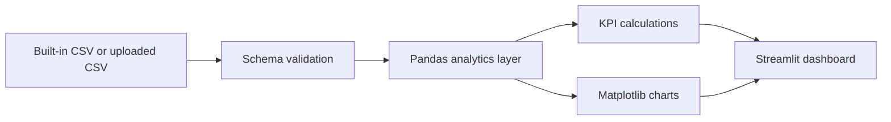

# End-to-End Python Pandas Data Analysis and Streamlit Dashboard


This repository contains a customer churn analysis notebook and a Streamlit dashboard for exploring churn drivers, customer behavior, subscription patterns, and simple directional business insights.

## Value Proposition

The project turns a raw customer churn CSV into a usable analytics dashboard. It is intended as an entry-level analytics portfolio project showing data loading, profiling, KPI calculation, segmentation, and visual storytelling with Python.

## Features

- Built-in churn dataset support
- Optional CSV upload for compatible churn datasets
- Required-column validation before analysis
- Dataset profile, missing-value summary, data types, and descriptive statistics
- Customer KPIs: churn rate, total spend, support calls, average tenure
- Visual dashboard for age, gender, subscription type, contract length, and churn patterns
- Simple future-insight calculations with clear caveats

## Architecture



## Project Structure

```text
End-to-End-Python-Pandas-Data-Analysis-and-Dashboard-with-Streamlit/
|-- dashboard.py              # Streamlit entrypoint
|-- requirements.txt
|-- README.md
|-- .gitignore
|-- data/
|   `-- churn_dataset.csv
|-- notebooks/
|   `-- exploratory_analysis.ipynb
|-- src/
|   `-- churn_dashboard/
|       |-- app.py            # UI orchestration
|       |-- analytics.py      # KPI and insight calculations
|       `-- schema.py         # required-column validation
|-- tests/
|   `-- test_analytics.py
`-- .github/workflows/ci.yml
```

## Required Dataset Schema

The dashboard expects these columns:

```text
CustomerID, Age, Gender, Tenure, Usage Frequency, Support Calls,
Payment Delay, Subscription Type, Contract Length, Total Spend,
Last Interaction, Churn
```

## Quick Start

```bash
python -m venv .venv
.venv\\Scripts\\activate
pip install -r requirements.txt
streamlit run dashboard.py
```

On macOS/Linux:

```bash
source .venv/bin/activate
```

## Usage

1. Run the Streamlit app.
2. Use the built-in churn dataset or upload a compatible CSV.
3. Open the dashboard, statistics, future insights, or dataset profile view.
4. Use the outputs for exploratory analysis and business storytelling.

## Development Workflow

```bash
set PYTHONPATH=src
pytest -q
python -m compileall dashboard.py src
streamlit run dashboard.py
```

On macOS/Linux:

```bash
export PYTHONPATH=src
```

## Quality Improvements Included

- Removed brittle positional-column logic.
- Added named-column validation.
- Added default dataset caching.
- Added error handling for invalid uploads.
- Added figure cleanup after rendering.
- Moved reusable logic into `src/churn_dashboard`.
- Added pytest coverage for schema validation, statistics, and insight functions.
- Added GitHub Actions CI for automated checks.

## Roadmap

- Add churn model training and evaluation
- Add correlation and cohort views
- Add downloadable executive report
- Add richer tests for chart rendering and upload handling

## Troubleshooting

| Issue | Fix |
|---|---|
| Missing column error | Use a CSV matching the required schema. |
| Blank dashboard | Load the built-in dataset or upload a valid CSV. |
| Charts look crowded | Filter or sample the dataset before upload. |

## License

No license file is currently included. Add a license before reusing or distributing this project.
